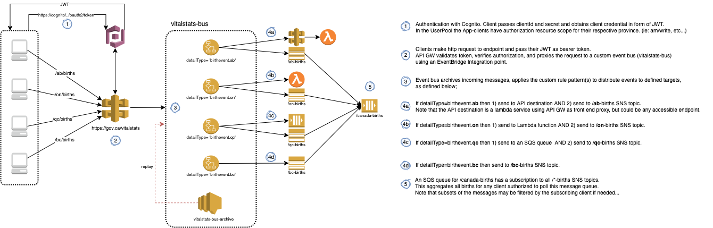

# Overview
This is a simple POC of an event bus using AWS serverless offerings. 
This repo contains .yaml configuration template used by the AWS SAM CLI to build and deploy AWS components which implement a basic event bus using EventBridge as the core.

The deployment creates the folloing artifacts:
- A Cognito userpool with defined resource servers having custom scopes and application clients configured so as to use an Oauth 2.0 client_credential flow.
- An API gateway proxy endpoint that allows Cognito authenticated/authorized client applications to publish events to the event bus.
- A custom EventBridge with defined rules/patterns and destination targets.
- SNS and SQS artifacts to receive both durable and non-durable events.
- A simple Lambda and API Gateway that serves as an API Destination target.

Looking something like this...

# Diagram


# Before deploying
- Install the AWS CLI 
    - https://docs.aws.amazon.com/cli/latest/userguide/getting-started-prereqs.html
- Install the SAM CLI 
    - https://docs.aws.amazon.com/serverless-application-model/latest/developerguide/serverless-getting-started.html
- Create an AWS user account in the respective AWS account with appropriate role/permissions to create resources in the cloud formation yaml template. (Out of scope to walk through this...)
- Configure AWS CLI credentials to use the client access key and secret provided for the created user in the above step. (Note that the AWS CLI credentials used for the default profile are found in the *~/.aws/credentials* file)

# Install
- Clone the repo into a working directory
    ```
    gh repo clone c-hobbins/aws-eventbridge-poc
    ```


# Build/Deploy

- Use the SAM cli commands to build and deploy into the AWS account (*using the AWS credentials already configured*)
    ``` 
    sam build
    sam deploy
    ```

# Test
- Run this from command line
    ```
    curl --location --request POST 'https://pya253jpt9.execute-api.ca-central-1.amazonaws.com' --header 'Content-Type: application/json' \
    --data-raw '{
        "Detail":{
            "message": "This is my test"
        }
    }'
    ```
- From postman...


# Cleanup
- Use the AWS CLI cloudformation command to delete the stack
    ```
    aws cloudformation delete-stack --stack-name eventbus-poc
    ```